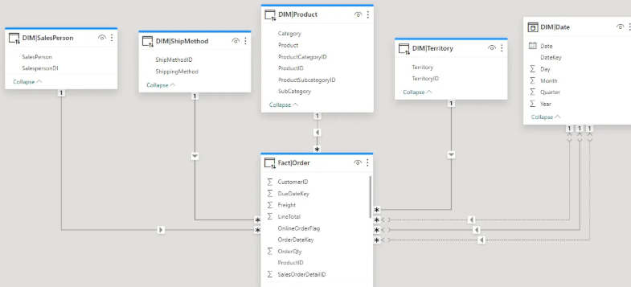

# Introducción

## Por qué surge Databricks?

Recordando que siempre que sale una herramienta es para soluccionar una necesidad o problema, antes se trabajaba con ``data wharehouse`` que estaba enfocado en almacenar datos estructurados para consultas, pero tenia un problema para almacenar datos no estructurados y además era costoso. Para ese problema surgio el ``data lake`` que incluye para almacenar ambos datos estructurados, semi-estructurado y no estructurados nos da esa flexibilidad y de bajo costo, pero sin control convirtiendolo en una bola de pelos. Para solucionar ese problema surge ``Arquitectura Data LakeHouse`` siendo la evolución del anterior que ofrece una gobernanza de datos y soporte para inteligencia de negocio (BI).

>Demostración

- datos estructurados: base de datos relacionales
- datos semi-estructurados: archivos JSON, XML, CSV, logs
- datos no estructurados: archivos de texto, imágenes, videos

## Conceptos de Inteligencia de negocios (Business Intelligence)

La Inteligencia de Negocios (BI) utiliza herramientas para recopilar, integrar y analizar los datos de una empresa, con el objetivo de tomar decisiones informadas.

### Tipos

| Concepto | Descripción |
| :--- | :--- |
| **OLTP** | Procesa transacciones en tiempo real (insertar, actualizar, eliminar). |
| **OLAP** | Sistemas usados para analizar grandes volúmenes de datos históricos. |
| **Cubo OLAP** | Estructura multidimensional generada en SQL Server u otra herramienta OLAP, pensada para consultas rápidas y análisis de datos. Se construye normalmente a partir de un Datamart. |
| **Data Warehouse** | Gran almacén de datos de toda la organización (datos centralizados). |
| **Datamart** | Parte específica de un DW, enfocada en un área de negocio (ej: ventas). De aquí se suelen generar los cubos OLAP. |
| **Data Mining** | Técnicas para buscar patrones ocultos y generar predicciones. |

### Diseño dimensional
El diseño dimensional es una técnica de modelado de datos que organiza los datos en tablas interrelacionadas, con el objetivo de facilitar consultas y análisis multidimensionales. Esto lo puedes ver en Power BI, en donde se utiliza cada vez más esta convención de nombres.

### Conceptos clave del diseño dimensional

* **Granularidad:** Nivel de detalle del dato (por día, por hora, por minuto…). Define qué representa una única fila en la tabla de hechos.
* **Tabla de Hechos:** Contiene métricas numéricas (medidas) y claves que apuntan a las dimensiones.
* **Tabla de Dimensiones:** Permiten analizar los hechos desde distintos criterios (tiempo, cliente, producto, ubicación).

---

### Tabla con Convenciones de Nombres

| Concepto | Convención / Prefijo | Descripción | Ejemplo de Nombre |
| :--- | :--- | :--- | :--- |
| **Tabla de Hechos** | `Fact` o `Hecho` | Se usa como prefijo para identificar tablas que contienen métricas, eventos cuantitativos y claves foráneas. | `FactVentas`, `FactInventario` |
| **Tabla de Dimensiones** | `Dim` | Se usa como prefijo para las tablas que contienen los atributos contextuales o descriptivos. | `DimCliente`, `DimProducto`, `DimTiempo` |
| **Granularidad** | *Definición clara* | No lleva un prefijo en el nombre de la tabla, pero se documenta en la descripción del modelo o se refleja en la dimensión de tiempo más baja. | *Granularidad: Diaria* |

### Modelos de diseño dimensional

| Modelo | Características |
| :--- | :--- |
| **Estrella** | Tabla de hechos al centro conectada a tablas de dimensiones |
| **Copo de Nieve** | Las dimensiones se normalizan (se dividen en más tablas) |
| **Constelación** | Varias tablas de hechos conectadas a dimensiones compartidas |

El flujo anterior era Data Warehouse → se divide en → Datamarts por área → se construyen Cubos OLAP → se usan para analizar datos y generar reportes. Esto tomaba mucho tiempo y recursos.

## ¿Qué es Databricks?

Es una plataforma unificada para trabajar con datos y IA, esta enfocado en procesar y analizar grandes volumenes de datos de forma eficiente.

Está construida sobre Apache Spark + Arquitectura LakeHouse + Consultas Analíticas con Gobernanza de Datos.

## Componentes claves

- Delta Lake: Capa de almacenamiento que aporta transacciones ACID y confiabilidad a los data lakes.
- Unity Catalog: Sistema de gobernanza unificado que centraliza la seguridad y control de todos los datos.
- Workflows & Jobs: Herramientas integradas para orquestación de pipelines, automatización y monitoreo.

## Arquitectura de Databricks

- Capa 4: Databricks Workspace: La interfaz de usuario donde ingenieros, científicos de datos y analistas colaboran en tiempo real dentro de notebooks y dashboards unificados.
- Capa 3: Gobernanza (Unity Catalog): El centro de control que define accesos, permisos y cumplimiento normativo (GDPR, HIPAA, etc.).
- Capa 2: Databricks Runtime: El entorno de ejecución optimizado que unifica la potencia de procesamiento distribuido de Apache Spark con la consistencia de Delta Lake.
- Capa 1: Infraestructura Cloud: La base física provista por AWS (S3, EC2), Azure (ADLS, VMs) o GCP (GCS, Compute Engine) que aporta escalabilidad elástica. Databricks no gestiona hardware propio.

## Separación de Responsabilidades (Planes de Arquitectura)

Para garantizar la máxima seguridad, Databricks divide sus operaciones de manera estricta:

- Control Plane: Gestionado por Databricks en su propia infraestructura. Se encarga de la orquestación, interfaz web, APIs y administración de clústeres, sin tocar nunca tus datos reales.
- Data Plane: Se ejecuta de forma nativa en tu cuenta de nube empresarial. Aquí residen físicamente el almacenamiento y los clústeres de cómputo (máquinas virtuales) ejecutando Spark. Los datos jamás salen de tu entorno seguro.

## Motor Core: Apache Spark y DBFS

- Apache Spark: Es el estándar de la industria para Big Data gracias a su procesamiento distribuido (paraleliza el trabajo dividiendo los datos en clústeres) y su procesamiento en memoria (RAM), lo que acelera las tareas iterativas hasta 100 veces más rápido que sistemas tradicionales como MapReduce.
- Databricks Filesystem (DBFS): Una capa de abstracción virtual (no es un almacenamiento físico independiente) que permite interactuar con los buckets de la nube (S3, ADLS, GCS) como si fuesen directorios locales. Simplifica la configuración de credenciales y permite lecturas/escrituras optimizadas para Spark.
